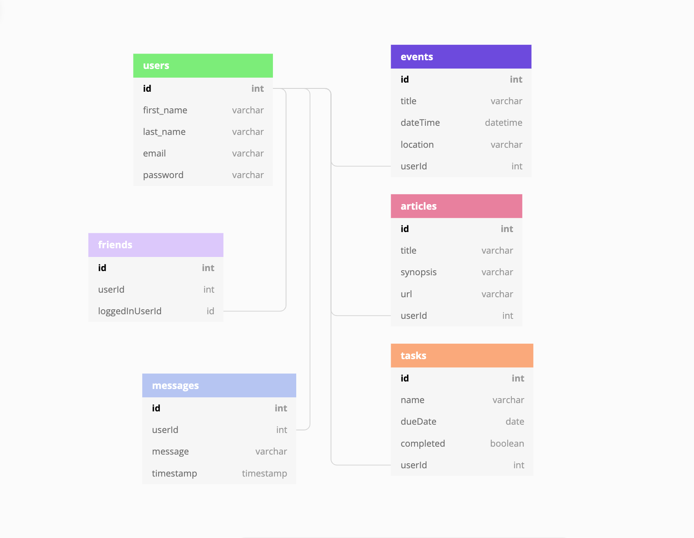
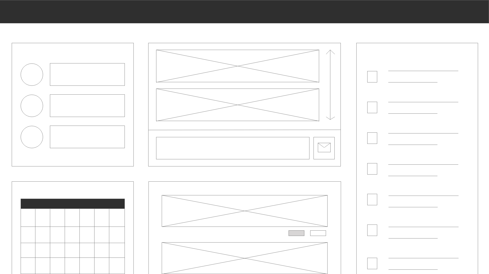

# Otter: The Information Dashboard

The contributors to this project were:
* Jeremiah Bell (To-Do List)
* Charles Jackson (News)
* Michelle Johnson (Events)
* Sam Pita (Messages)

## The Planning Process

We took time before writing any code to develop an Entity Relationship Diagram laying out our database relationships. This is shown below:

We also created a basic wireframe for what we wanted our application to look like.

## Why is the application called Otter?

Otters are social animals. They hold hands while sleeping so they don't drift apart from each other. We named this application Otter to represent staying connected to one another with this information dashboard.

## Download Instructions

1. Click the green "Clone or download" button located at the top right of this repository.
1. Copy the link below *Clone with SSH*
1. Run the command `git clone <paste link here>`
1. `cd` into the directory it creates
1. In the `api` directory, create a copy of the `database.json.example` and remove the .example extension.
1. Run `npm install` and wait for all dependencies to be installed
1. Run `npm start` to verify that installation was successful.

## Application Instructions

1. Create an account
2. You will then be automatically taken to the Main Page
3. You will see a Friends, Events, Messages, News, and To-Do List section.
4. You can create a new Event, Message, or To-Do task.
5. You can also share a new article or add a new Friend.
6. Click "Logout" to sign out of the application!